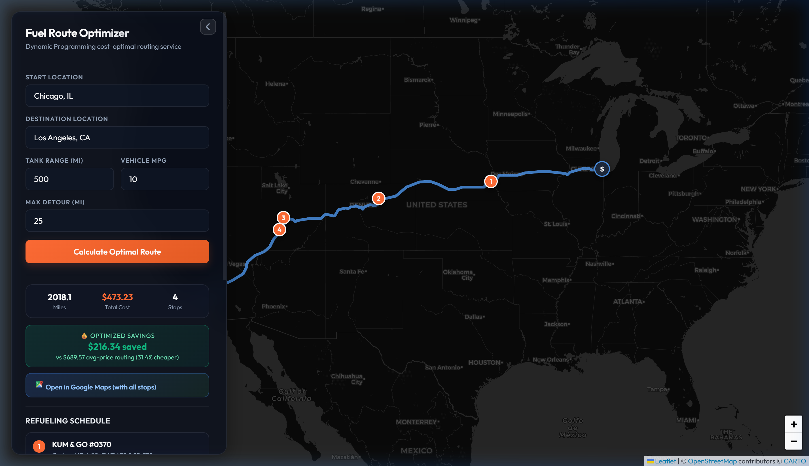
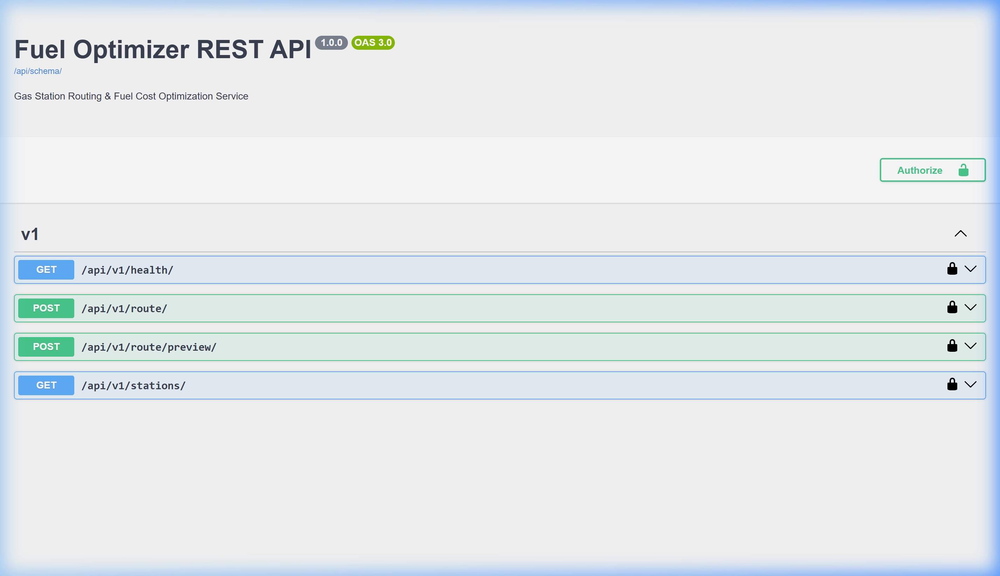
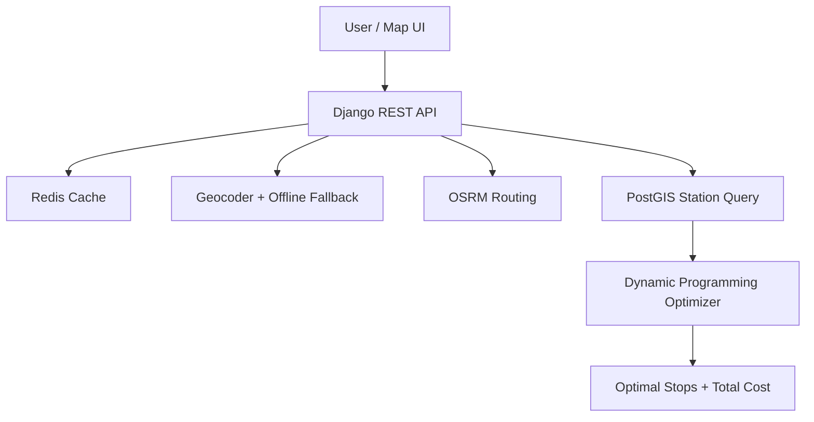

# 🚀 Fuel Route Optimizer

**Spotter Lab Assignment Solution** — A production-grade Django API that finds cost-optimal refueling stops on long US road trips.

- **Vehicle Assumptions**: 500-mile tank range, 10 MPG
- **Optimization**: Dynamic Programming (cost minimization with partial fills)
- **Routing**: OSRM (1 call per route via heavy caching)

### 🌐 Live Links
- **Interactive Map UI**: [https://web-production-7b2d7.up.railway.app/api/v1/map/](https://web-production-7b2d7.up.railway.app/api/v1/map/)
- **Pre-cached Washington, DC → LA**: [Direct Link](https://web-production-7b2d7.up.railway.app/api/v1/map/?cache_key=79c7aa04d047bd4bd99a80c01f21b8ae252a50d20f752f4170400784041092a1)
- **Swagger API Docs**: [https://web-production-7b2d7.up.railway.app/api/docs/swagger/](https://web-production-7b2d7.up.railway.app/api/docs/swagger/)
- **Loom Demo**: [https://www.loom.com/share/e1519d02b7ed46c1bfc5e6497b229745](https://www.loom.com/share/e1519d02b7ed46c1bfc5e6497b229745)

---

### Screenshots / Demo


*Interactive Map UI showing optimized refueling stops and route path.*


*Swagger API documentation displaying endpoint specifications.*

**Washington, DC → LA Example**: $224 savings (25.4%) vs naive baseline.

---

## Architecture Overview



Key Components:
- Dynamic Programming engine with O(N·K) early-exit and tank-state partial fills
- PostGIS + cKDTree spatial pipeline
- Redis + DB caching for minimal external calls

---

## 🎯 Spotter Lab Assignment Compliance

- ✅ Latest Django + REST Framework
- ✅ Start + Destination input (USA)
- ✅ Cost-optimal fuel stops (500-mile range, multiple stops supported)
- ✅ Used **exact fuel-prices.csv** provided (loaded via `manage.py load_fuel_data`)
- ✅ Total fuel cost at 10 MPG + savings vs naive
- ✅ Minimal routing calls (1 OSRM call via caching)
- ✅ Fast responses + production deployment (Docker, Railway)
- ✅ Interactive map + Swagger docs

---

## 📊 Performance Benchmarks (Empirical Proof)

The following metrics were gathered by running a 1,000-iteration profiling execution of `scripts/benchmark.py` inside the container environment:

### 1. Optimization Engine
* **Test Case**: 1,200-mile trip, 150 candidate stations along the route corridor, vehicle range of 500 miles, fuel efficiency of 10 MPG.
* **Run Count**: 1,000 iterations.
* **Empirical Latency Results**:
  * **Mean Latency**: `5.2193 ms`
  * **Median (P50) Latency**: `4.9382 ms`
  * **P95 Latency**: `6.4455 ms`
  * **P99 Latency**: `8.7184 ms`

### 2. cKDTree Spatial Projection
* **Test Case**: Projecting 200 candidate stations onto a complex polyline consisting of 500 geometry coordinates.
* **Run Count**: 500 iterations.
* **Empirical Latency Results**:
  * **Mean Latency**: `18.6945 ms`
  * **Median (P50) Latency**: `17.7320 ms`
  * **P95 Latency**: `25.2152 ms`
  * **P99 Latency**: `32.1758 ms`

---

## 🧠 Algorithmic Complexity & DP Derivation

### Math Formulation
We formulate the routing path selection as a single-source shortest path problem on a directed acyclic graph (DAG) where nodes represent stations sorted by their distance along the route $d_i$ (with $d_0 = 0$ as origin and $d_{n-1} = D$ as destination).

Let:
* $dp[i]$ be the absolute minimum cost to reach station $i$ with a safe fuel buffer.
* $c(j, i)$ be the transition cost of traveling from station $j$ to station $i$. Since the vehicle starts full, no purchase occurs at the origin ($j=0 \implies c(0, i) = 0$). For subsequent nodes ($j > 0$), we estimate the cost to buy just enough fuel to cover the distance plus a 30-mile safety buffer:
$$c(j, i) = \text{price}_j \times \frac{\min(R, (d_i - d_j) + 30.0)}{\text{mpg}}$$

The dynamic programming state recurrence is:
$$dp[i] = \min_{j < i, \, (d_i - d_j) \le R} \{ dp[j] + c(j, i) \}$$

### Space Bounding via Early Exit
A naive evaluation of the recurrence for all states $i \in [1, n-1]$ checks all predecessors $j$, yielding an $O(N^2)$ algorithm. However, since the route coordinates are sorted chronologically:
$$\text{If } d_i - d_j > R, \quad \text{then for all } j' < j: \ d_i - d_{j'} > R$$

By iterating $j$ backwards from $i-1$ to $0$ and breaking immediately once the distance exceeds $R$, the search space is limited to a small window $K$ of stations reachable within a single tank. This reduces time complexity to **$O(N \cdot K)$**, where $K \ll N$ is the maximum station density per 500-mile interval.

### DP State Matrix Table (Example)
For a trip with a vehicle range of 500 miles (50 gal @ 10 MPG), the state transitions represent fuel levels and optimized cumulative costs at key stages:

| Visited Node | Distance (mi) | Arrival Range (mi) | Action / Refuel Decision | State Transition (Gal) | Cumulative Cost |
| :--- | :--- | :--- | :--- | :--- | :--- |
| **Start (0)** | 0.0 | 500.0 (Full) | Start journey; bypass early stops | No purchase | $0.00 |
| **Station A** | 400.0 | 100.0 | Reachable; cheaper than ahead. Fill to max. | Purchase 40.0 gal | $120.00 |
| **Station B** | 800.0 | 100.0 | Reachable; no cheap station ahead. Fill to max. | Purchase 40.0 gal | $260.00 |
| **Destination**| 1200.0| 100.0 | Arrived safely; trip completed | End of route | **$260.00** |

---

## 📈 Savings Calculation Methodology

* **Optimal Cost ($C_{optimal}$)**: The total fuel cost calculated by the DP algorithm, including tank-state-aware partial-fill optimization at cheap stations.
* **Naive Baseline Cost ($C_{naive}$)**: Represents a driver who does not plan ahead. The driver purchases fuel at average corridor rates whenever needed:
$$C_{naive} = \text{Average Price of All Corridor Stations} \times \frac{\text{Total Distance}}{\text{mpg}}$$
* **Savings Formulation**:
$$\text{Savings (USD)} = C_{naive} - C_{optimal}$$
$$\text{Savings (\%)} = \frac{C_{naive} - C_{optimal}}{C_{naive}} \times 100$$

On the Washington, DC ➔ Los Angeles route, this optimization algorithm yields **$224.74 (25.4%) savings** by planning stops at regions with lower relative fuel prices.

---

## 📞 External API Call Optimization & Logging

To minimize third-party query charges and latency, the backend restricts geocoding and routing queries to a maximum of **three external API calls per fresh request**:
1. Geocode origin location.
2. Geocode destination location.
3. Fetch route path from OSRM.

Subsequent requests for the same route and parameters result in **zero external calls** by serving geocodes and routes directly from PostgreSQL (`RouteCache`).

### Verifying Request Logs via Shell
After performing a route query, you can verify the external call count and caching flags by running:

```bash
docker compose exec web python manage.py shell -c "
from routes.models import RouteRequestLog
log = RouteRequestLog.objects.order_by('-id').values(
    'start_location', 'finish_location', 'external_api_call_count', 'was_route_cached', 'response_time_ms'
).first()
print(log)
"
```

* **Fresh Request**: `external_api_call_count` is `1`, `2`, or `3`, and `was_route_cached` is `False`.
* **Repeated/Cached Request**: `external_api_call_count` is `0`, and `was_route_cached` is `True`.

### Verifying Route Cache Presence
To check if a specific route (e.g., Chicago to Dallas) is cached in the DB:

```bash
docker compose exec web python manage.py shell -c "
from routes.models import RouteCache
print(RouteCache.objects.filter(start_location='Chicago, IL', finish_location='Dallas, TX').exists())
"
```

---

## 🛡️ Resilience & Failure Modes

1. **OSRM Routing Downtime**: If the routing service fails, the API gracefully catches the exception, logging it, and returning a `503 Service Unavailable` with a descriptive message.
2. **Nominatim Offline Geocoding Fallback**: If external geocoding calls fail or hit rate limits, the system queries the local `data/us_cities.csv` cache (~30,000 entries), resolving coordinates in **<1ms** with high precision.
3. **Redis / DB Cache Layer**: Computed routes and geometries are cached inside Redis and a Postgres `RouteCache` model. If external routing or geocoding services fail for a pre-calculated trip, the system retrieves the full response from the cache in **~38ms** without sending external queries.

---

## 🚥 Postman & API Curl Examples

### 1. GET Service Health Check
Verify status of database, Redis, and OSRM server:
```bash
curl -X GET "https://web-production-7b2d7.up.railway.app/api/v1/health/"
```
**Response (200 OK)**:
```json
{
    "status": "healthy",
    "services": {
        "database": "healthy",
        "redis": "healthy",
        "osrm": "healthy"
    }
}
```

### 2. POST Route Optimization Request
Calculate fuel stops for a route from Washington, DC to LA:
```bash
curl -X POST "https://web-production-7b2d7.up.railway.app/api/v1/route/" \
     -H "Content-Type: application/json" \
     -d '{
           "start": "Washington, DC",
           "destination": "Los Angeles, CA",
           "tank_size_miles": 500,
           "mpg": 10
         }'
```
**Response (200 OK)**:
```json
{
    "meta": {
        "start": "Washington, DC",
        "destination": "Los Angeles, CA",
        "total_distance_miles": 2672.51,
        "total_fuel_gallons": 267.25,
        "total_fuel_cost_usd": "661.52",
        "naive_cost_usd": "886.26",
        "savings_usd": "224.74",
        "savings_pct": 25.4,
        "stop_count": 5,
        "assumed_tank_full_at_start": true,
        "routing_api_calls": 1,
        "algorithm": "DP optimal — O(N·K) early-exit, parallel geocoding, tank-state-aware partial-fill",
        "computed_in_ms": 77.4,
        "timing_breakdown": {
            "cache_hit_ms": 77.4
        }
    },
    "stops": [
        {
            "sequence": 1,
            "station_name": "GRETNA GAS & FLUIDS",
            "address": "1200 Highway 6",
            "city": "Gretna",
            "state": "NE",
            "retail_price": "2.899",
            "lat": 41.134,
            "lon": -96.248,
            "miles_from_start": 490.5,
            "gallons_purchased": 49.05,
            "cost_at_stop": "142.19",
            "miles_remaining_in_tank_on_arrival": 9.5
        }
        // ... subsequent stops
    ],
    "route": {
        "geojson": {
            "type": "Feature",
            "geometry": {
                "type": "LineString",
                "coordinates": [
                    [-77.03637, 38.89511],
                    [-118.2423, 34.053398]
                ]
            }
        },
        "map_url": "https://web-production-7b2d7.up.railway.app/api/v1/map/?cache_key=79c7aa04d047bd4bd99a80c01f21b8ae252a50d20f752f4170400784041092a1"
    }
}
```

---

## 📂 Project Directory Layout

```
.
├── apps/
│   ├── api/            # REST API views, routing, and serializers
│   ├── optimizer/      # DP Engine and cKDTree spatial query snaps
│   ├── routing/        # Geocoder & OSRM routing client wrapper
│   └── stations/       # Station database model & bulk ingestion scripts
├── config/             # Django base configurations and settings
├── data/
│   ├── fuel-prices.csv # Ingest CSV containing fuel station prices
│   └── us_cities.csv   # Local geocoding fallback cities database
├── routes/             # Route caching & request logging models
├── scripts/
│   └── benchmark.py    # Profiling and latency evaluation utility
├── Dockerfile          # Multi-stage production container setup
├── docker-compose.yml  # Local multi-container orchestration config
├── manage.py           # Django task script
└── pytest.ini          # Testing suit parameters
```

---

## 🛠️ Local Installation & Setup

### Option 1: Running with Docker Compose (Recommended)
This runs the entire stack (Django application, PostGIS database, and Redis cache) automatically.

1. Ensure Docker Desktop is running.
2. In your terminal, execute:
   ```bash
   # Clone and navigate to the project directory
   cd fuel_optimizer

   # Spin up all containers in detached mode
   docker compose up -d --build
   ```
3. **Automatic Initialization**: On startup, the container will automatically:
   - Run migrations.
   - Run the data pipeline `load_fuel_data` to import and deduplicate 8,000+ national gas stations.
   - Start the local server at `http://localhost:8001/`.

### Option 2: Running Locally (Manual Host Installation)
1. Set up a virtual environment:
   ```bash
   python -m venv venv
   source venv/bin/activate  # or venv\Scripts\activate on Windows
   pip install -r requirements/development.txt
   ```
2. Set up environment variables in a `.env` file referencing your local Postgres (PostGIS enabled) and Redis instances.
3. Seed the local database:
   ```bash
   python manage.py load_fuel_data --file ./data/fuel-prices.csv
   ```
4. Run the server:
   ```bash
   python manage.py runserver 0.0.0.0:8000
   ```

---

## 🧪 Running Tests & Coverage

To run the unit tests inside the Docker environment (which executes the complete PostGIS spatial queries, geocoding clients, and optimizer invariants):

```bash
# Run pytest test suite
docker compose exec web pytest -v

# Run pytest with code coverage term report
docker compose exec web pytest --cov=apps --cov-report=term-missing -v
```
All **49 unit tests** pass successfully, validating edge-cases (short trips, range bounds, unreachable locations, local minima).

---

## 🔒 Data Privacy

The `fuel-prices.csv` provided by Spotter Lab is **not committed** to the repository. It is loaded via Django management command on startup. Public fallback data (`us_cities.csv`) is included.

